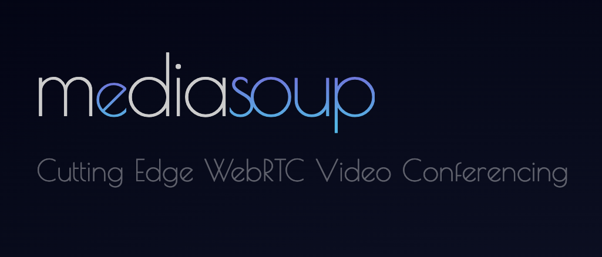
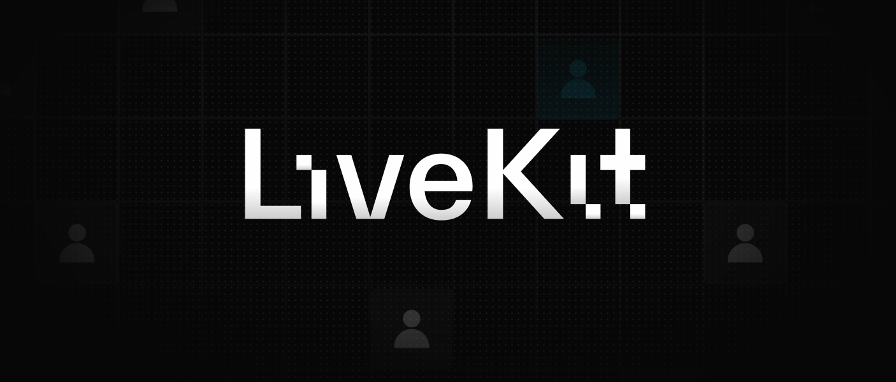

This site contains **simple**, **functional** and **comprehensible** guided tutorials for [**LiveKit**](https://livekit.io/){target=\_blank} applications. They all offer basically the same functionality, but built with different platforms in the client side and the server side, all compatible with each other. Just choose the ones that better fit your needs.

You can use them purely for didactic purposes, but also as a solid starting point to build your own application.

## What is LiveKit?

[LiveKit](https://livekit.io/){target=\_blank} is an open source, cutting edge, end-to-end WebRTC stack with which you can build ultra-low latency real-time audio and video applications. It offers the latest technologies in terms of real-time media, and a fantastic collection of [SDKs](https://docs.livekit.io/reference/){target=\_blank} for both your application's server and client.

With the power of LiveKit you can add video conferencing capabilities to your platform, build the next big live streaming application or even add AI processing to your media flow (such as AI conversational agents or computer-vision recognition). The possibilities are truly endless!

## Architecture of a Livekit application

<figure markdown="span">
  { .do-not-include-in-gallery width="600" style="border-radius: 8px" }
  <figcaption>Architecture of a LiveKit application</figcaption>
</figure>

Any LiveKit application has 3 different parts:

- **Your LiveKit Server**: provides all the necessary infrastructure for streaming real-time audio and video. It can usually be treated as a black box in which its internal aspects are not important: you just deploy it and connect your application to it.
- **Your Application Client**: runs in your user devices and interacts with the LiveKit deployment through any **LiveKit Client SDK**. Your users will join rooms as participants to send and receive real-time audio and video tracks. It needs a token generated by the Application Server to join a room. Here you can find examples of Application Clients in different frontend languages: [Application Clients](./tutorials/application-client/).
- **Your Application Server**: interacts with the LiveKit deployment through any **LiveKit Server SDK**. At a minimum, it is responsible for the generation of tokens for the Application Client to join a room. But you can implement your own business logic managing rooms, participants and tracks from the safety of your Application Server. Here you can find examples of Application Servers in different backend languages: [Application Servers](./tutorials/application-server/).

## Tutorials

### Application client tutorials

Every application client below shares the same core functionality:

- Users request a LiveKit token to any [application server](#application-server-tutorials) to connect to a room.
- Users may publish their camera, microphone and screen-share.
- Users automatically subscribe to all media published by other users.
- Users may leave the room at any time.
  <!-- - Users may mute and unmute their tracks. -->
  <!--- Users may select which camera, microphone or screen they want to publish.-->
  <!--- Users may communicate through a chat.-->

Every application client below is interchangeable with the others, because:

- All of them are compatible with each other, meaning that participants are able to join the same LiveKit room from any of the client applications.
- All of them are compatible with any [application server](#application-server-tutorials), meaning that they can request a LiveKit token from any of the server applications.

[:simple-javascript:{.icon .lg-icon .tab-icon} **JavaScript**](./tutorials/application-client/javascript.md){ .md-button .md-button--primary .tutorial-link}

[:simple-react:{.icon .lg-icon .tab-icon} **React**](./tutorials/application-client/react.md){ .md-button .md-button--primary .tutorial-link}

[:simple-angular:{.icon .lg-icon .tab-icon} **Angular**](./tutorials/application-client/angular.md){ .md-button .md-button--primary .tutorial-link}

[:simple-vuedotjs:{.icon .lg-icon .tab-icon} **Vue**](./tutorials/application-client/vue.md){ .md-button .md-button--primary .tutorial-link}

[:simple-electron:{.icon .lg-icon .tab-icon} **Electron**](./tutorials/application-client/electron.md){ .md-button .md-button--primary .tutorial-link}

[:simple-ionic:{.icon .lg-icon .tab-icon} **Ionic**](./tutorials/application-client/ionic.md){ .md-button .md-button--primary .tutorial-link}

[:simple-react:{.icon .lg-icon .tab-icon} **React Native**](./tutorials/application-client/react.md){ .md-button .md-button--primary .tutorial-link}

[:simple-flutter:{.icon .lg-icon .tab-icon} **Flutter**](./tutorials/application-client/flutter.md){ .md-button .md-button--primary .tutorial-link}

[:simple-android:{.icon .lg-icon .tab-icon} **Android**](./tutorials/application-client/android.md){ .md-button .md-button--primary .tutorial-link}

[:simple-apple:{.icon .lg-icon .tab-icon} **iOS**](./tutorials/application-client/ios.md){ .md-button .md-button--primary .tutorial-link}

### Application server tutorials

Every application server below has two specific purposes:

- Generate LiveKit tokens on demand for any [application client](#application-client-tutorials).
- Receive LiveKit [webhook events](https://docs.livekit.io/realtime/server/webhooks/){target=\_blank}.

To do so they all define two REST endpoints:

- `/token`: takes a room and participant name and returns a token.
- `/webhook`: for receiving webhook events from LiveKit Server.

They use the proper [LiveKit Server SDK](https://docs.livekit.io/reference/){target=\_blank} for their language, if available.

[:simple-nodedotjs:{.icon .lg-icon .tab-icon} **NodeJS**](./tutorials/application-server/node.md){ .md-button .md-button--primary .tutorial-link }

[:simple-goland:{.icon .lg-icon .tab-icon} **Go**](./tutorials/application-server/go.md){ .md-button .md-button--primary .tutorial-link}

[:simple-ruby:{.icon .lg-icon .tab-icon} **Ruby**](./tutorials/application-server/ruby.md){ .md-button .md-button--primary .tutorial-link}

[:fontawesome-brands-java:{.icon .lg-icon .tab-icon} **Java**](./tutorials/application-server/java.md){ .md-button .md-button--primary .tutorial-link}

[:simple-python:{.icon .lg-icon .tab-icon} **Python**](./tutorials/application-server/python.md){ .md-button .md-button--primary .tutorial-link}

[:simple-rust:{.icon .lg-icon .tab-icon} **Rust**](./tutorials/application-server/rust.md){ .md-button .md-button--primary .tutorial-link}

[:simple-php:{.icon .lg-icon .tab-icon} **PHP**](./tutorials/application-server/php.md){ .md-button .md-button--primary .tutorial-link}

[:simple-dotnet:{.icon .lg-icon .tab-icon} **.NET**](./tutorials/application-server/dotnet.md){ .md-button .md-button--primary .tutorial-link}

### Advanced tutorials

Explore more advanced features of LiveKit: recording, screen-sharing and participant roles.

[:material-record-rec:{.icon .lg-icon .tab-icon} **Egress**](./tutorials/advanced-tutorials/recording.md){ .md-button .md-button--primary .tutorial-link }

[:material-monitor-screenshot:{.icon .lg-icon .tab-icon} **Screen share**](./tutorials/advanced-tutorials/screenshare.md){ .md-button .md-button--primary .tutorial-link }

[:fontawesome-solid-user-shield:{.icon .lg-icon .tab-icon} **Roles**](./tutorials/advanced-tutorials/roles.md){ .md-button .md-button--primary .tutorial-link }

## About the authors of this site

This site has been created and is maintained by the [OpenVidu](https://openvidu.io){target=\_blank} team. OpenVidu developers have been working with real-time media for over a decade. We first developed [Kurento](https://kurento.openvidu.io/){target=\_blank} as a powerful media server with low-level capabilities, and then built OpenVidu as a higher-level platform to simplify the development of real-time applications.

{ .do-not-include-in-gallery style="padding: 2rem" }
{ .do-not-include-in-gallery style="padding: 2rem" }

{ .do-not-include-in-gallery style="padding: 2rem" }
{ .do-not-include-in-gallery style="padding: 2rem" }

As the years went by, we continued to improve OpenVidu, making it more efficient, more versatile and more feature-rich. We finally made the decision to embrace [mediasoup](https://mediasoup.org/){target=\_blank} as the internal engine of the platform. mediasoup is an open source SFU designed down to the last detail to deliver the highest possible performance. We love this project: we are very close to it and have collaborated on it on several occasions.

<figure markdown="span">
  { .do-not-include-in-gallery width="500" style="border-radius: 8px; margin: 12px 0;" }
</figure>

We have helped thousands of developers, companies and organizations to build their real-time applications. Over the years we have seen a myriad of successful use cases built on top of OpenVidu: e-learning, telemedicine, video conferencing, live streaming, proctoring, real-time surveillance, remote assistance... The list goes on and on.

We are now bringing our expertise to [LiveKit](https://livekit.io/){target=\_blank}, and integrating its amazing WebRTC stack directly into OpenVidu.

<figure markdown="span">
  { .do-not-include-in-gallery width="500" style="border-radius: 8px; margin: 12px 0;" }
</figure>

Check out section [What is OpenVidu?](./about-openvidu.md) to learn more about how OpenVidu can help you take your LiveKit applications to the next level.

 